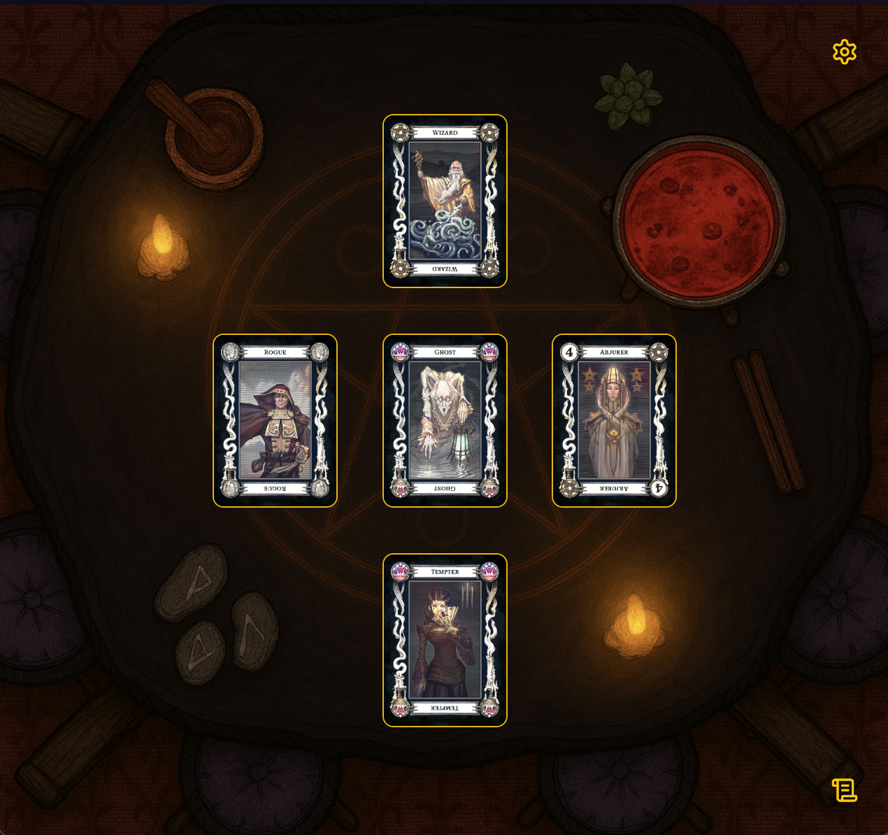

# 🃏 Tarokka

**Tarokka** is a real-time Tarokka card reading app for _Dungeons & Dragons: Curse of Strahd_. It simulates Madam Eva’s fortune-telling, revealing a hero’s fate and Strahd’s secrets, and is built to deliver an authentic, immersive experience for DMs and players alike.



You can see it live at:
👉 [https://tarokka.mcmorgans.us](https://tarokka.mcmorgans.us)

---

## ✨ Features

- 🔮 **Faithful to the Tarokka Deck**: Supports all cards and positions used by Madam Eva's reading.
  - 💬 Dynamic prophecy rendering based on card and position
  - 🎨 Multiple card styles
- 🧙 Separate DM and Spectator Views
  - ⚙️ DM can toggle what information is visible to players.
  - 🃏Every action (flipping cards, settings changes) is broadcast live to connected users.
- 🌐 Fully browser-based — no accounts or installs
- 📱 Mobile-friendly UI
- 🔁 WebSocket-Powered Real-Time Sync

---

## 🚀 Getting Started

### Development

```bash
git clone https://github.com/mcdoh/tarokka.git
cd tarokka
npm install
npm run dev
```
