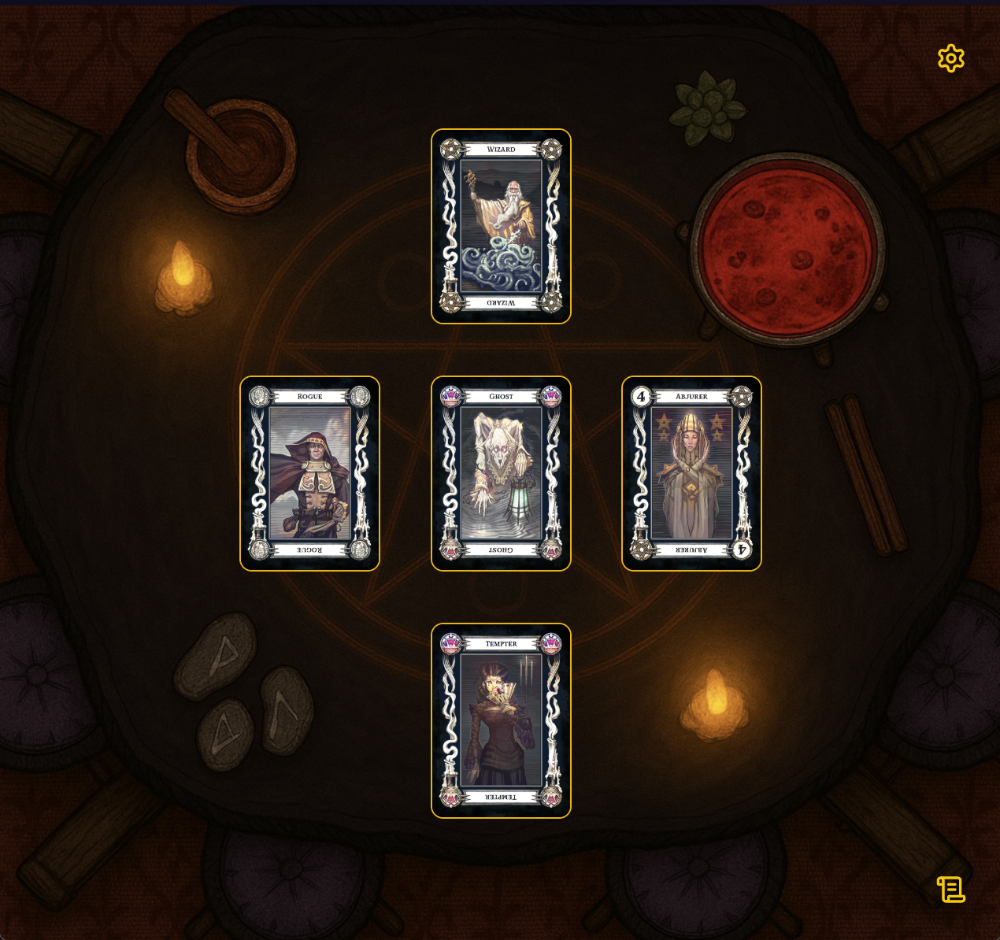

# 🃏 Tarokka

**Tarokka** is a real-time Tarokka card reading app for _Dungeons & Dragons: Curse of Strahd_. It simulates Madam Eva’s fortune-telling, revealing a hero’s fate and Strahd’s secrets, and is built to deliver an authentic, immersive experience for DMs and players alike.

To be honest, I’d say this is overkill for what is a relatively small aspect of _Curse of Strahd_ but I had fun making it. It’s a [Next.js](https://nextjs.org/) app running a custom server in order to employ [Socket.IO](https://socket.io/). When a new session is created the DM (dungeon master) is presented a game with the cards shuffled and laid out on the table. There is a link available for sharing the session to any spectators. The DM has access to settings that allow for limiting what info spectators have access to (card purpose, prophecy, notes) and the style of cards used.



You can see it live at:
👉 [https://tarokka.app](https://tarokka.app)

---

## ✨ Features

- 🔮 **Faithful to the Tarokka Deck**: Supports all cards and positions used by Madam Eva’s reading.
  - 💬 Dynamic prophecy rendering based on card and position
  - 🎨 Multiple card styles
- 🧙 Separate DM and Spectator Views
  - ⚙️ DM can toggle what information is visible to players.
  - 🃏Every action (flipping cards, settings changes) is broadcast live to connected users.
- 🌐 Fully browser-based — no accounts or installs
- 📱 Mobile-friendly UI
- 🔁 WebSocket-Powered Real-Time Sync

---

## 🚀 Getting Started

### Development

```bash
git clone https://github.com/mcdoh/tarokka.git
cd tarokka
npm install
npm run dev
```
